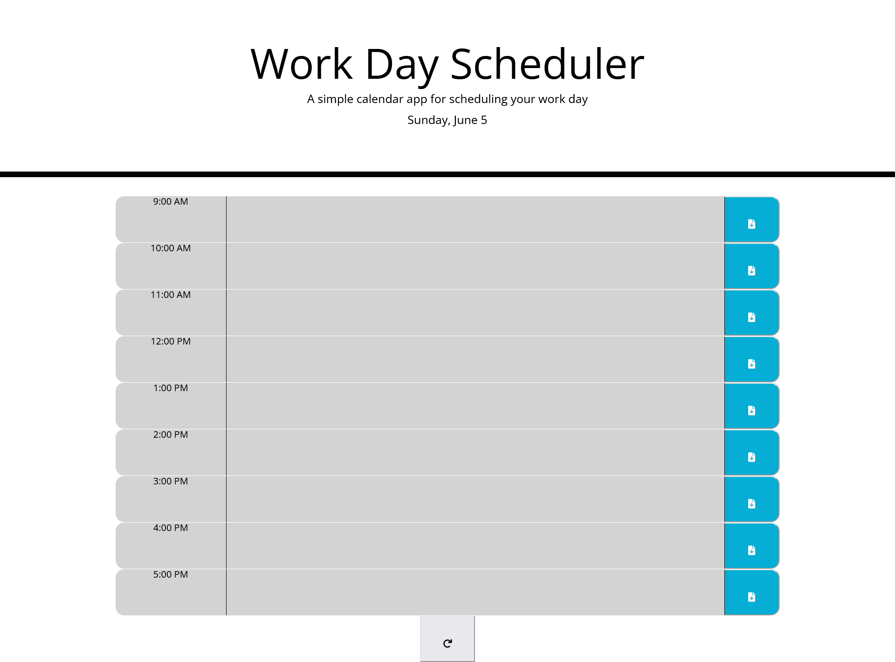

# Module 5 Challenge

## Table of Contents

- [Overview](#overview)
  - [The challenge](#the-challenge)
  - [User Story](#user-story)
  - [Acceptance Criteria](#acceptance-criteria)
  - [Screenshot](#screenshot)
  - [Links](#links)
- [My process](#my-process)
  - [Built with](#built-with)
  - [What I learned](#what-i-learned)
  - [Continued development](#continued-development)
  - [Useful resources](#useful-resources)
- [Author](#author)
- [Acknowledgments](#acknowledgments)
  ​

## Overview

This weeks challenge was modify the given code to create a work day scheduler.
​

### The challenge

​Create a workday scheduler using all currently learned tools that utilizes local storage for events.

### User Story

```md
AS AN employee with a busy schedule
I WANT to add important events to a daily planner
SO THAT I can manage my time effectively
```

### Acceptance Criteria

```md
GIVEN I am using a daily planner to create a schedule
WHEN I open the planner
THEN the current day is displayed at the top of the calendar
WHEN I scroll down
THEN I am presented with timeblocks for standard business hours
WHEN I view the timeblocks for that day
THEN each timeblock is color coded to indicate whether it is in the past, present, or future
WHEN I click into a timeblock
THEN I can enter an event
WHEN I click the save button for that timeblock
THEN the text for that event is saved in local storage
WHEN I refresh the page
THEN the saved events persist
```

### Screenshot



### Links

- Solution URL: [Solution](https://github.com/lafflin/05-Workday-Schedule)
- Live Site URL: [Site](https://lafflin.github.io/05-Workday-Schedule/)
  ​

## My process

1. The first thing I did was link moment.js and finish the current date display at the top of the page
2. Next I made the different time blocks so and gave them the proper classes and ID's
3. After this I implemented the code to change the colors of the time blocks depending on the time of the day. This is where I hit the first issue in that I was not using 24-hour times for my hours (ex: 1pm = 13)
4. After this I made the save buttons work so that the local storage could hold the variables. I followed this by adding the code to make sure the old local storage values would still show on page reload.
5. Upon finishing this I implemented the icons, then realized that a reset button may be useful, so I added that to the page, incase someone wanted to easily reset their scheduler for another day.

### Built with

- HTML
- CSS
- Bootstrap
- JavaScript
- jQuery
- FontAwesome
- Moment.js

### What I learned

- Javascript is not always as scary as it seems.

### Continued development

- Need a lot more work with javascript. Still struggling a lot with it but the more I work on things with it the easier it gets... slowly.

### Useful resources

- [Denigma](https://denigma.app/) - Helped me in understanding some code that was not making sense to me (js:13 in particular, as I knew that the code worked, but just reading it I initially could not tell what it was doing)

## Author

- Linkedin - [Max McLaughlin](https://www.linkedin.com/in/max-mcla/)

## Acknowledgments

- StackOverflow- Hugely helpful for this project, getting through this one was easier due to the research I did while doing this project as well as random things I remembered from researching while working on other projects.
